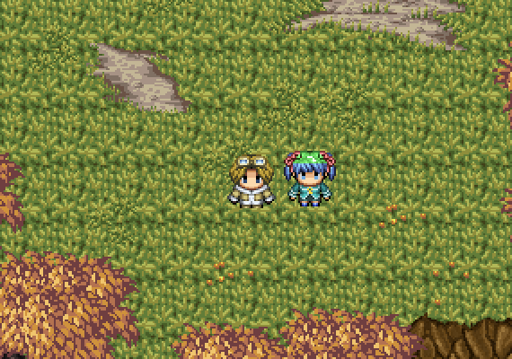

# Mage City

Mage City is an ongoing learning experiment aiming to recreate the aesthetic and some gameplay elements of 90's Nintendo RPG action games like [_Secret of Mana_][1].

[Try it here][home].

## Project status

The following features have been implemented:

* [Terrain rendering on the GPU][3], with support with multiple layers
* Basic WebGL shaders for most common use-cases like static textured quads and animated quads
* Obstacle detection, currently used to block player on map bounds
* Keyboard input
* Player walk movements
* Game assets loading (textures only)

## Possible roadmap

* Game entities (initially just collectable items and triggers)
* Text rendering
* Player inventory
* Dialog system
* Non-playing characters (NPC)
* Enemies and simple AI
* Weapons and player melee attack
* Mouse input
* Pathfinding
* Background music and sound effects

## Tiled integration

Levels in Mage City have been designed using the open-source [Tiled level editor][2] and converted in Elm data structures using the `elmify` command line utility.

## Game art credits

* Mage City and Forest tile sets by [Daniel "Hyptosis" Harris][4]
* Player sprites by [Penelope Williams][5]
* NPC sprites by [Anthony Angelo Alvarez][9]

## Code credits

Mage City contains portions of:

* Florian Zinggeler's [Game.TwoD][6] and [Game.Resources][8]
* Nicolas Fernandez's [Collision2D][7]

[1]: https://en.wikipedia.org/wiki/Secret_of_Mana
[2]: http://www.mapeditor.org
[3]: http://blog.tojicode.com/2012/07/sprite-tile-maps-on-gpu.html
[4]: http://hyptosis.deviantart.com
[5]: http://italy-pastalove.deviantart.com
[6]: http://package.elm-lang.org/packages/Zinggi/elm-2d-game/latest/
[7]: http://package.elm-lang.org/packages/burabure/elm-collision/latest
[8]: http://package.elm-lang.org/packages/Zinggi/elm-game-resources/latest
[9]: http://elysianangel8.deviantart.com
[home]: http://lab.passiomatic.com/mage-city/
